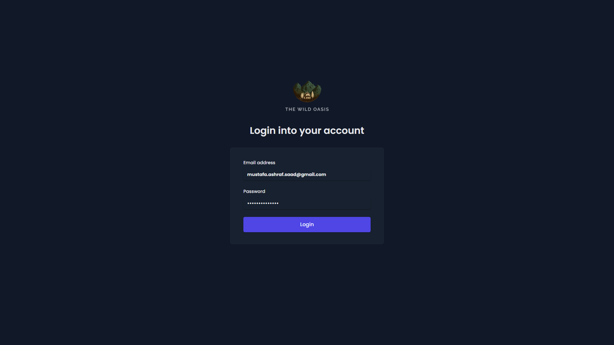
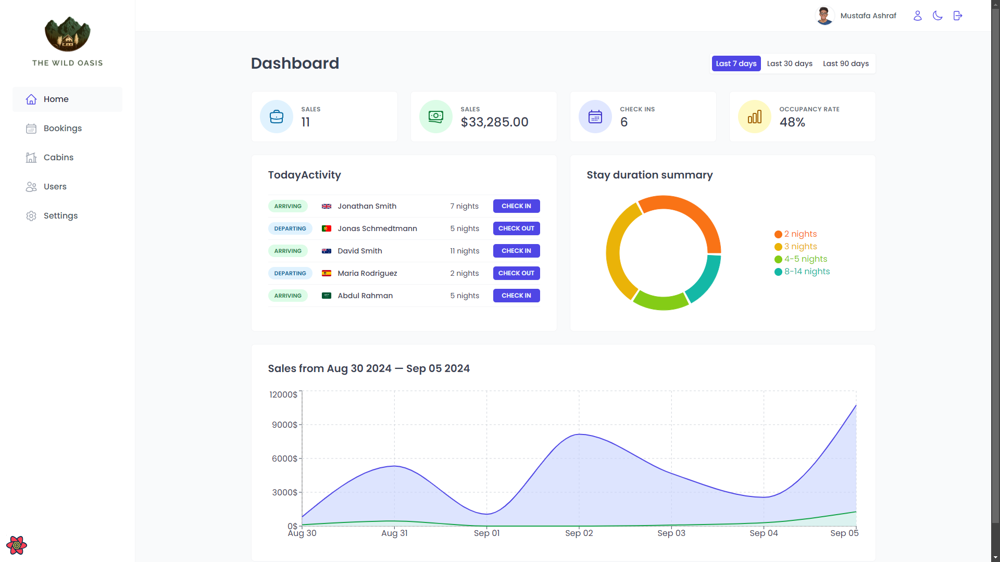
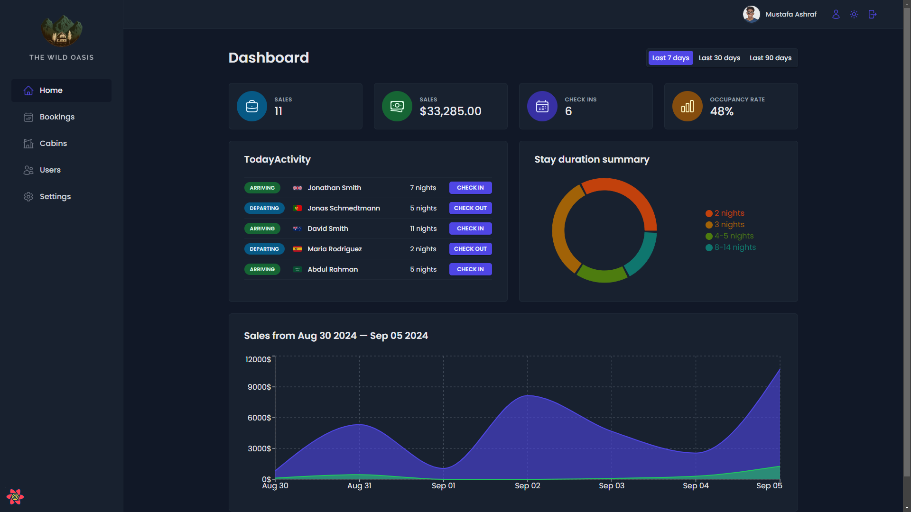
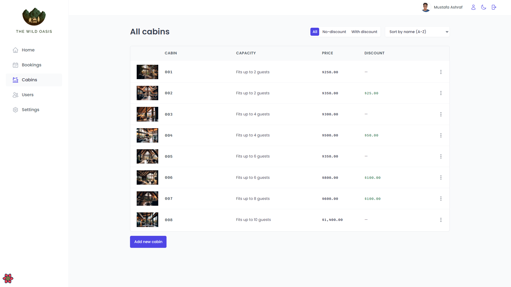
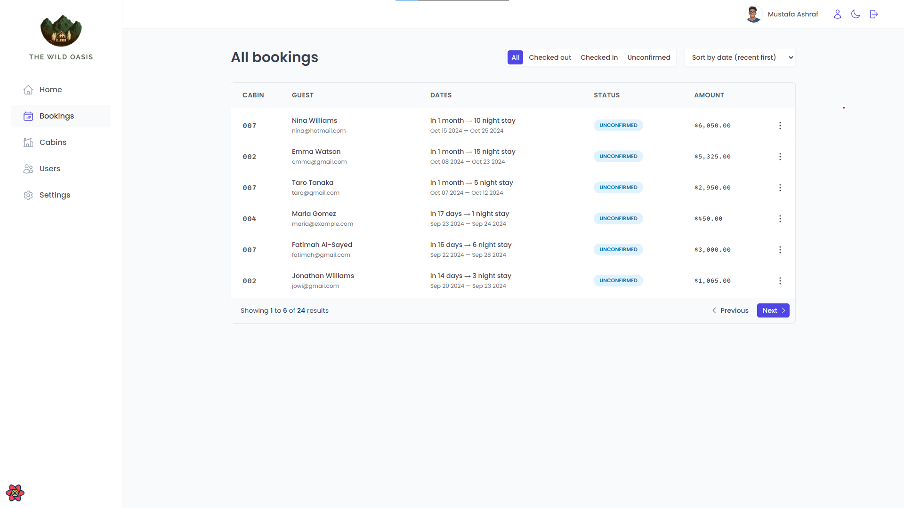
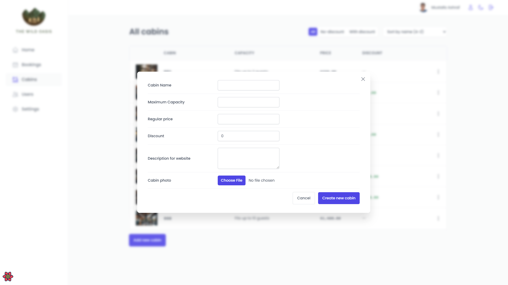
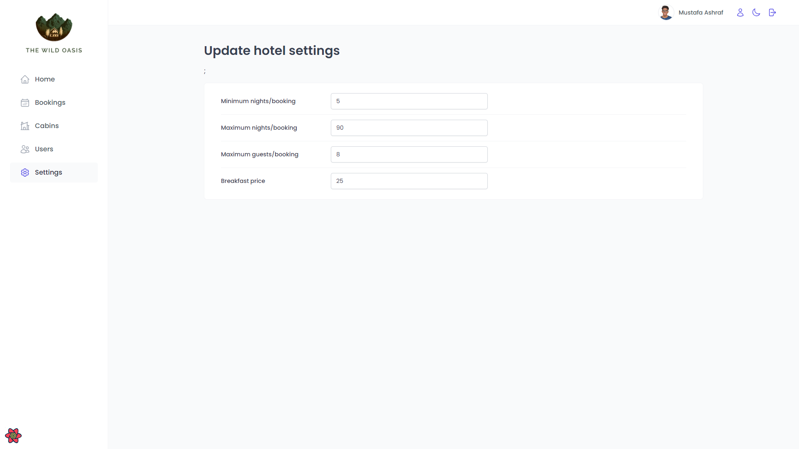
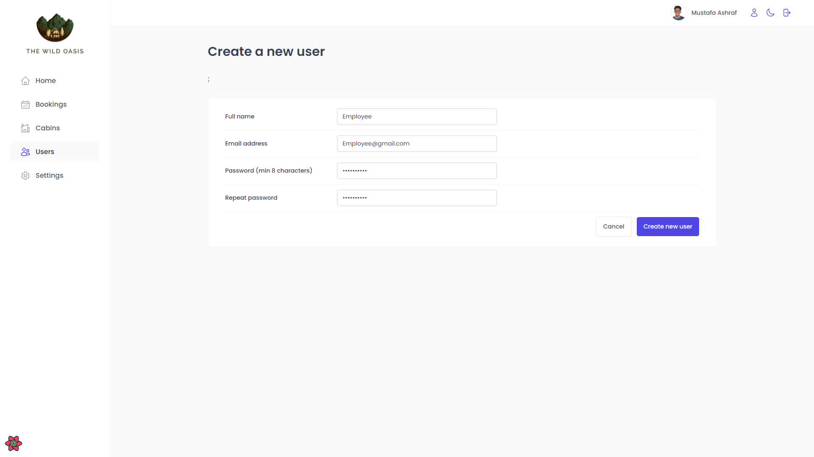
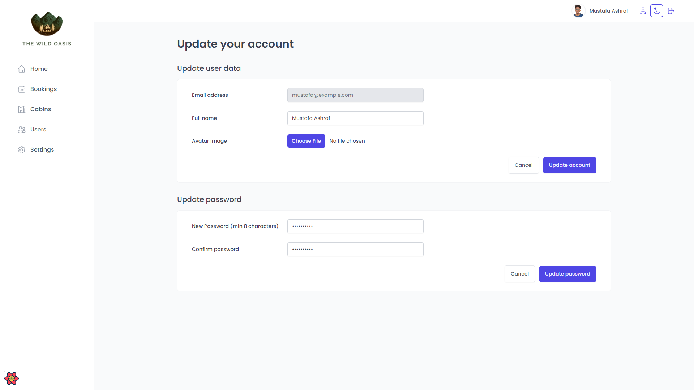

# Wild Oasis

Wild Oasis is a boutique hotel application designed to manage bookings for 8 luxurious wooden cabins. This client-side rendered, single-page application facilitates check-ins, check-outs, and guest information management.

## Table of Contents

- [Features](#features)
- [Screenshots](#screenshots)
- [Getting Started](#getting-started)
  - [Installation](#installation)
  - [Usage](#usage)
- [Components](#components)
- [Contributing](#contributing)
- [License](#license)
- [Contact](#contact)

## Features

- **Authentication**: Users must log in to perform tasks; new users can sign up within the application.
- **Dashboard**:
  - Displays information for the last 7, 30, and 90 days, including:
    - A list of guests checking in and out
    - Stats on recent bookings, sales, and occupancy rates
    - A chart showing daily hotel sales and stay durations
- **Cabins**:
  - A table view of all bookings, showing:
    - Arrival and departure dates
    - Status and paid amount
    - Cabin and guest data
- **Settings**:
  - Displays full name, email, nationality, and country flag. Users can change their full name, avatar, and email.
- **Dark Mode**: Implemented for a better user experience.

## Screenshots

<table>
  <tr>
    <td></td>
    <td></td>
    <td></td>
  </tr>
  <tr>
    <td></td>
    <td></td>
    <td></td>
  </tr>
  <tr>
    <td></td>
    <td></td>
    <td></td>
  </tr>
</table>

## Getting Started

### Installation

To set up the project locally:

1. Clone the repository:

   ```bash
   git clone https://github.com/MustafaAFarag/The-Wild-Oasis.git
   cd The-Wild-Oasis
   ```

2. Install dependencies:

   ```bash
   npm install
   ```

3. Start the development server:

   ```bash
   npm run dev
   ```

4. Open your browser and visit `http://localhost:5173` to view the application.

### Usage

1. Sign up or log in to your account.
2. Explore the dashboard to view guest check-ins, bookings, and sales stats.
3. Manage cabin bookings, check availability, and make adjustments as necessary.
4. Access the settings to update your profile information.

## Components

The main components of Wild Oasis include:

- **Landing Page**: Introduction to the app with links to login and signup.
- **Dashboard**: Overview of guest statistics and booking information.
- **Cabins Management**: View and manage all bookings.
- **Settings**: User profile management.
- **Authentication**: Secure login and registration.

## Contributing

Contributions are welcome! Please follow these steps:

1. Fork the repository.
2. Create a new branch: `git checkout -b feature/YourFeature`.
3. Make your changes and commit them: `git commit -m 'Add some feature'`.
4. Push to the branch: `git push origin feature/YourFeature`.
5. Open a pull request.

## License

This project is licensed under the MIT License. See the [LICENSE](LICENSE) file for details.

## Contact

For any inquiries or issues, please reach out to:

- **Mustafa Ashraf** - [mustafa.ashraf.saad@gmail.com ](mailto:mustafa.ashraf.saad@gmail.com)
